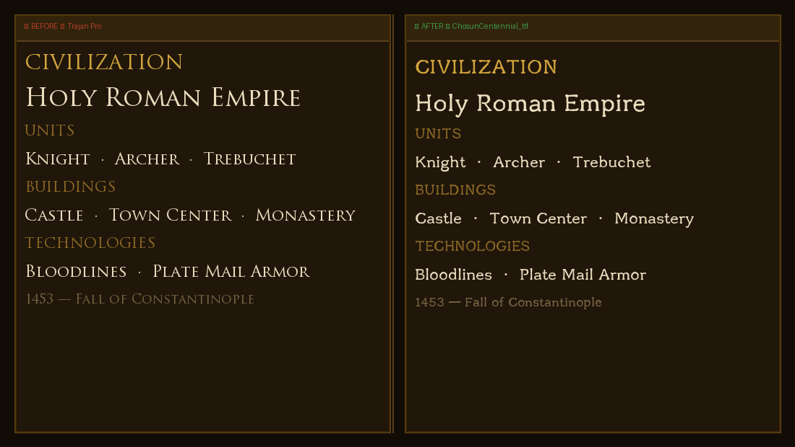

# AoE2DE フォント Mod — macOS

**Age of Empires II: Definitive Edition** macOS（Steam ネイティブ版）のゲーム内フォントを置き換えるツールです。

**他の言語：** [English](README.md) · [한국어](README.ko.md) · [中文](README.zh.md)



> **左：** オリジナルフォント（Trajan Pro）— 韓国語非対応
> **右：** Mod 適用後（조선100년체）— 韓国語が正常表示

---

## 必要環境

- macOS（Apple Silicon または Intel）
- Steam 経由でインストールされた Age of Empires II: DE
- Python 3（macOS に標準搭載）

---

## 使い方

### フォントを適用する

```bash
./apply_font.sh /path/to/font.ttf
```

### 元のフォントに戻す

```bash
./apply_font.sh restore
```

初回実行時に仮想環境が自動作成され、依存パッケージがインストールされます。

---

## 仕組み

AoE2DE はゲーム内テキストのレンダリングにビットマップフォントアトラスシステムを使用しています。このツールは：

1. 元の `combined.box` ファイルから必要なコードポイントを抽出
2. FreeType を使って指定フォントの各グリフを 64px でレンダリング
3. 全グリフを 2048×2048 のテクスチャページにパッキング
4. 新しい `combined.box`、`combined.txt`、`combined_XXXX.DDS` ファイルを生成

初回実行時、元のファイルは `fonts_atlas_backup/` に自動バックアップされます。

---

## 注意事項

- **ゲームオプションでフォントスタイルをセリフに設定してください**（オプション → インターフェース → フォントスタイル）。この Mod はセリフ（`combined`）アトラスのみを変更するため、サンセリフに設定すると効果がありません。
- 置き換えられるのはゲーム内テキストアトラス（`combined`）のみです。サンセリフアトラスと UI アイコンはそのまま維持されます。
- Steam によるゲームアップデート後は修正ファイルが上書きされる場合があります。アップデート後に再度スクリプトを実行してください。
- `wpfg/fonts` フォルダは macOS 版では効果がありません。

---

## ライセンス

MIT
